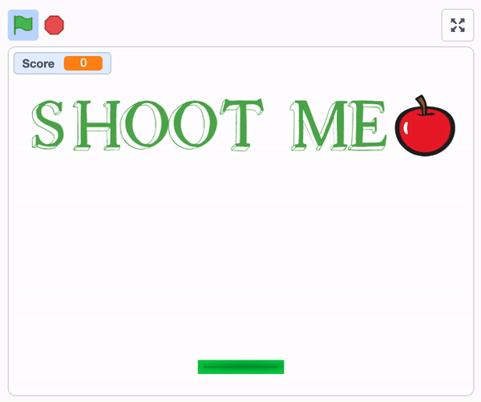

# Problem Set 0

The solution for problem set 0 was written in [Scratch](https://scratch.mit.edu/).

## Solution requirements

The requirements for the solution are as follows:

> * Your project must have at least two sprites, at least one of which must resemble something other than a cat.
> * Your project must have at least three scripts total (i.e., not necessarily three per sprite).
> * Your project must use at least one condition, one loop, and one variable.
> * Your project must use at least one sound.
> * Your project should be more complex than most of those demonstrated in lecture (many of which, though instructive, were quite short) but it can be less complex than Ivy’s Hardest Game. As such, your project should probably use a few dozen puzzle pieces overall.

## Example

## Usage

Open the .sb3 file in Scratch.

Control paddle using left and right arrow keys and press spacebar to shoot ball.
